# AWS IAM & Security Audit Tool

[](https://github.com/hemanth2k5-png/aws-iam-security-audit/actions/workflows/ci.yml)

A Python tool that scans an AWS account for common security misconfigurations and reports each one with a severity and a suggested fix. It uses only read-only AWS API calls, so it can audit an account without being able to change anything in it.

I built this as my first AWS project while learning cloud fundamentals, aiming at cloud support and security-adjacent roles. Every check was tested by deliberately creating the misconfiguration in a sandbox account, confirming the tool caught it, and cleaning it up.

## What it does

- Audits IAM users and the root account for missing MFA and stale or unused access keys
- Finds overly permissive IAM policies: wildcard admin statements, `AdministratorAccess` attached directly, and inline policies
- Detects S3 buckets exposed through Block Public Access gaps, public bucket policies, or public ACLs
- Flags security groups open to the internet, with higher severity for sensitive ports such as SSH, RDP, and databases
- Verifies CloudTrail is enabled, multi-region, and actively logging
- Produces a unified findings report (JSON, CSV, and HTML) with a severity and remediation note for every finding
- Runs from a command-line interface with profile, region, and output options
- Is covered by unit tests using `moto`, run automatically by GitHub Actions on every push
- Runs on a schedule as an AWS Lambda function and sends alerts through SNS
- Stores findings history in S3 and queries it with Glue and Athena to track trends and time to remediation

The HTML report, with the account ID masked to its last four digits:

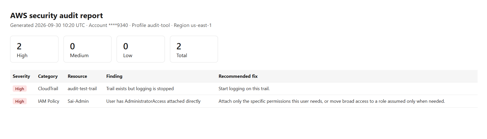
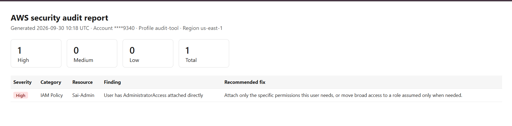

## Architecture

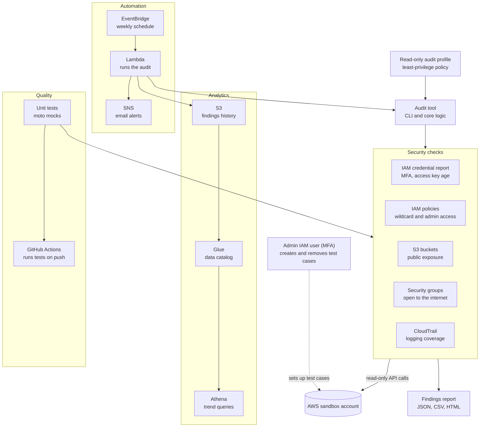

## Design decisions

- **Two identities, separated duties.** An admin IAM user (protected by MFA) creates test misconfigurations. A separate audit user only observes. The audit user cannot create, modify, or delete anything, and I confirmed this by checking that write actions return `AccessDenied` under its profile.
- **Least-privilege policy.** The audit user's IAM policy lists exact read actions and nothing else. See `docs/audit-tool-policy.json`.
- **No secrets in the repo.** Credentials live in the local AWS CLI profile. `.gitignore` excludes `*.csv` and generated reports.
- **Test before trusting.** A check that returns nothing could mean "clean" or "broken", so each check was verified against a deliberately bad resource first.

The read-only policy, the audit user, and proof that a write attempt is denied under the audit profile:

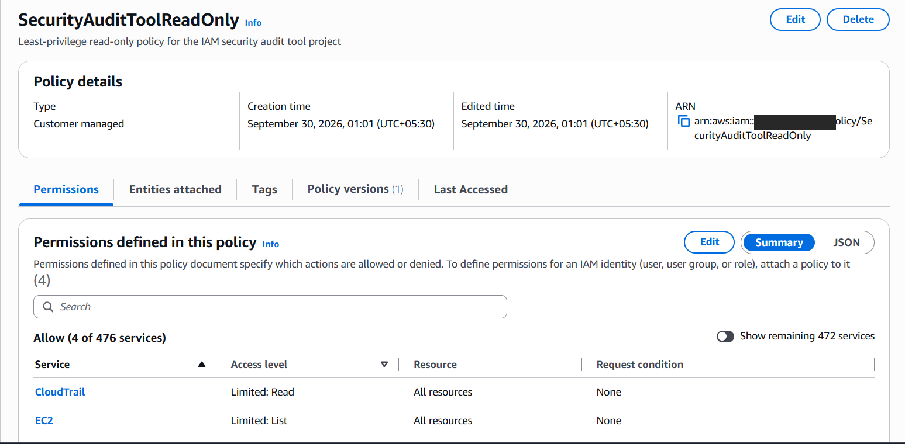
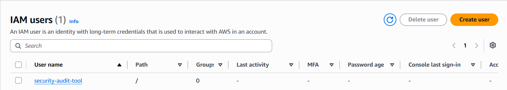
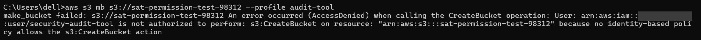

A budget alert guards against surprise charges in the sandbox account:

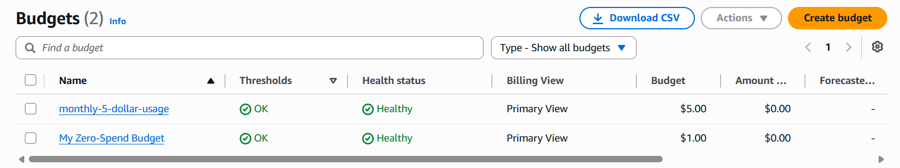

## Checks

### IAM credential report
Uses `generate_credential_report` and `get_credential_report`, which cover every IAM user and the root account in one call. Flags users without MFA and access keys past the age threshold (default 90 days) or unused.

### IAM policies
Excess access can hide in three places, and all three are checked:
- AWS-managed `AdministratorAccess` or `PowerUserAccess` attached directly to a user
- Customer-managed policies with `Action: *` on `Resource: *`
- Inline user policies with the same wildcard pattern


### S3 public exposure
Buckets can be exposed three independent ways, so each bucket is checked for:
- Block Public Access missing or not fully enabled
- A bucket policy that AWS reports as public
- An ACL granting access to `AllUsers` or `AuthenticatedUsers`


### Security groups
Flags inbound rules open to `0.0.0.0/0` or `::/0`:
- **High:** all traffic open, or a sensitive port exposed (22, 3389, 3306, 5432, 1433, 27017)
- **Medium:** any other port open to the world (may be intentional, such as 80 or 443, so it needs review)

Security groups are regional, so this check covers the region set in the profile.


### CloudTrail
Flags accounts with no trail, no multi-region trail, or a trail that is not actively logging. Without an audit log, the other findings cannot be investigated after the fact.

No trail at all, then a trail that exists but has logging stopped:

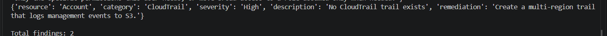
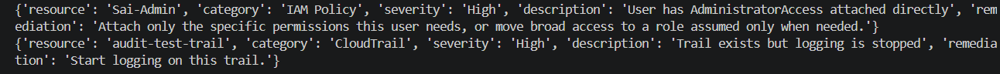

## Setup

Requirements: Python 3.12+, AWS CLI v2, and an AWS account you own (use a sandbox, not production).

```powershell
git clone https://github.com/hemanth2k5-png/aws-iam-security-audit.git
cd aws-iam-security-audit
python -m venv venv
.\venv\Scripts\Activate.ps1
pip install -r requirements.txt
aws configure --profile audit-tool
```

Create the `audit-tool` profile from an IAM user that has only the read-only policy.

## Usage

```powershell
python main.py --profile audit-tool --region us-east-1 --output report.html
```

Run the tests:

```powershell
pytest
```

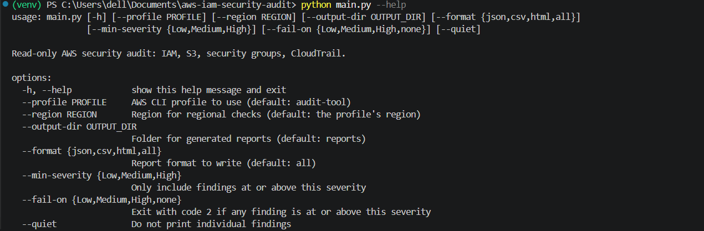
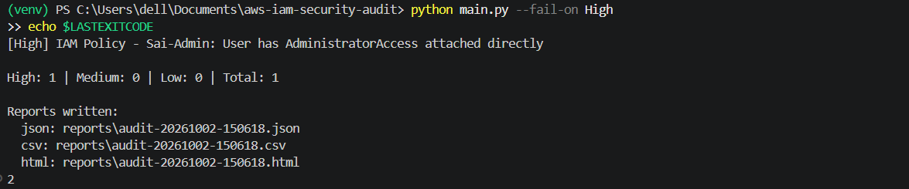
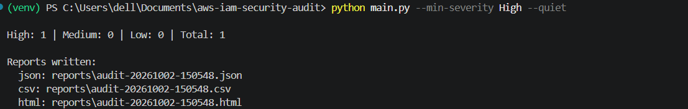

All 34 tests pass locally, and GitHub Actions runs them on Python 3.12 and 3.13 for every push:


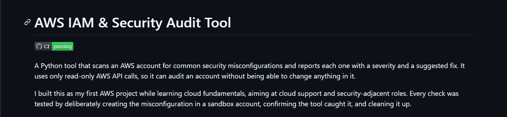

## Automation

The audit runs weekly as an AWS Lambda function triggered by an EventBridge schedule. Each run sends a summary through SNS and writes its findings to S3.

The schedule is every Monday at 14:00 UTC. The Lambda role has the same read-only policy plus permission to publish alerts:


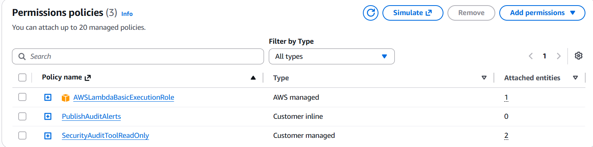


## Analytics

Every run appends its findings to S3, partitioned by date. Glue catalogs the data and Athena answers questions such as findings per category over time, which issues keep recurring, and how long a resource stayed non-compliant before it was fixed.

Each run writes a findings file and a run summary under date partitions:

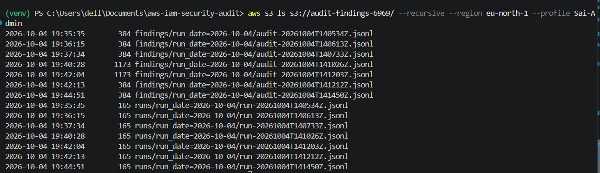

Athena result for resolved findings and mean time to remediation:

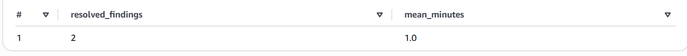

## Sample output

Account and resource IDs below are placeholders.

```
{'resource': 'admin-user', 'category': 'IAM Policy', 'severity': 'High', 'description': 'User has AdministratorAccess attached directly', ...}
{'resource': 'sg-0123456789abcdef0 (sat-open-test)', 'category': 'Security Group', 'severity': 'High', 'description': 'Sensitive port(s) open to the world: 22 (SSH)', ...}
{'resource': 'sg-0123456789abcdef0 (sat-open-test)', 'category': 'Security Group', 'severity': 'Medium', 'description': 'Port range 8080-8080 (tcp) open to the world', ...}
```

## Known trade-offs

The tool flags my own admin user for having `AdministratorAccess` attached directly. This is accepted for a personal learning account and mitigated with MFA. In a real organization I would scope permissions down or use a role assumed only when needed.

## Problems I hit and fixed

- **Wrong IAM action name.** I used `s3:GetPublicAccessBlock`; the real action is `s3:GetBucketPublicAccessBlock`. IAM matches names exactly, so the S3 check failed with `AccessDenied` until I fixed the policy. I confirmed the fix by re-running the check.
- **Findings not printing.** I appended the S3 findings after the print loop, so they never appeared. Fix: run every check first, then print.
- **CLI profile names are case-sensitive.** `Sai-Admin` and `sai-admin` are different profiles.
- **Placeholders in PowerShell.** Angle brackets in a command like `<policy-arn>` are redirection operators, not placeholders.
- **moto did not behave like real AWS.** It does not load AWS-managed policies, and `get_bucket_policy_status` can omit `IsPublic`. I built test policies inside moto and made the S3 check use safe lookups, with a regression test for the missing field. The first S3 test run failed (4 tests) before this fix.
- **Lambda handler name and timeout.** The handler had to be set to `lambda_handler.handler`, and the default 3-second timeout was too short, so I raised it to 60 seconds.
- **Region mismatch.** Lambda and SNS were created in `eu-north-1` while I was running commands against `us-east-1`. Resources and CLI commands have to use the same region.
- **Environment variable format.** `FINDINGS_BUCKET` needs the bucket name, not the ARN.

## Possible extensions

- Scan all regions instead of only the profile's region
- Add checks for unencrypted S3 buckets and RDS instances
- Send findings to AWS Security Hub

## Tech

Python, boto3, AWS IAM, S3, EC2, CloudTrail, Lambda, EventBridge, SNS, Glue, Athena, pytest, moto, Jinja2, GitHub Actions.
