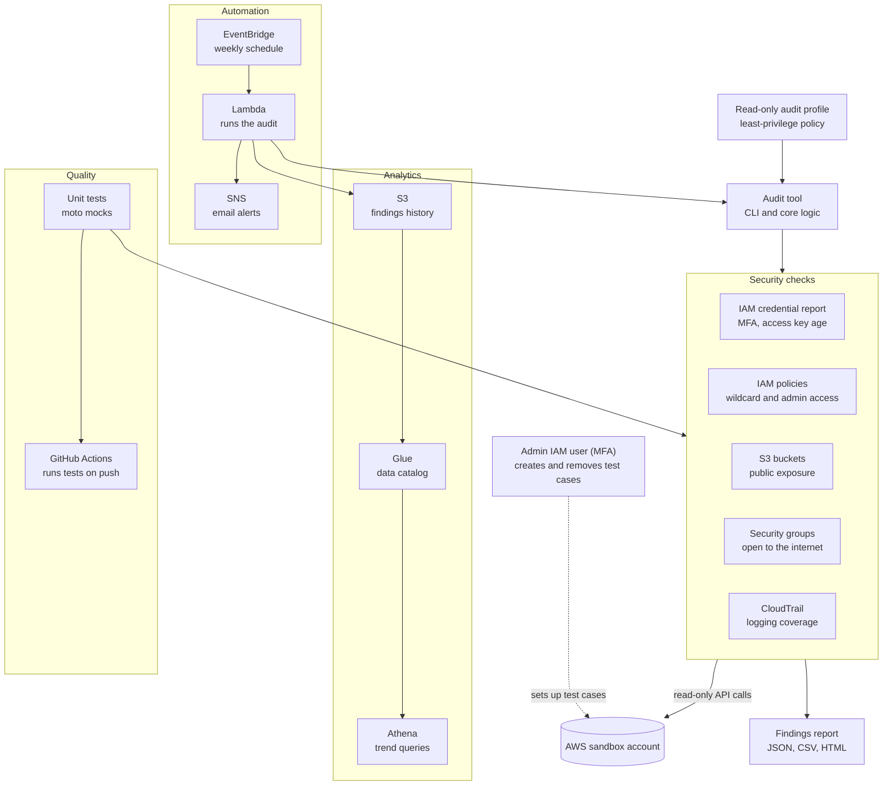
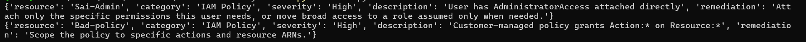
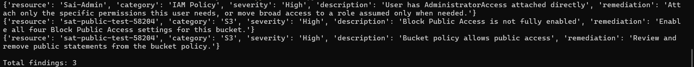
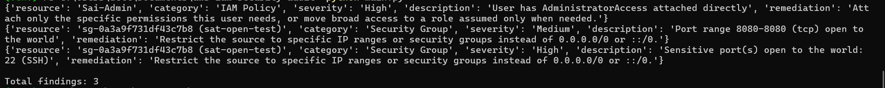
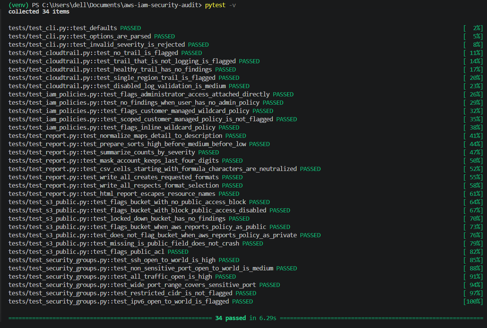
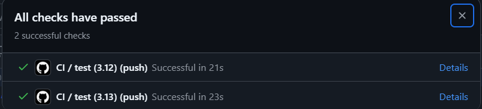
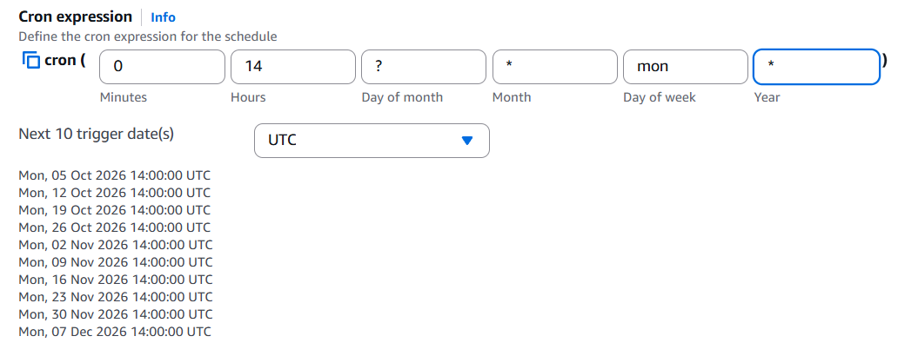
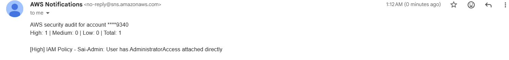

# AWS IAM & Security Audit Tool

[](https://github.com/hemanth2k5-png/aws-iam-security-audit/actions/workflows/ci.yml)

A Python tool that scans an AWS account for common security misconfigurations and reports each one with a severity and a suggested fix. It uses only read-only AWS API calls, so it can audit an account without being able to change anything in it.

I built this as my first AWS project while learning cloud fundamentals, aiming at cloud support and security-adjacent roles. Every check was tested by deliberately creating the misconfiguration in a sandbox account, confirming the tool caught it, and cleaning it up.

## What it does

- Audits IAM users and the root account for missing MFA and stale or unused access keys
- Finds overly permissive IAM policies: wildcard admin statements, `AdministratorAccess` attached directly, and inline policies
- Detects S3 buckets exposed through Block Public Access gaps, public bucket policies, or public ACLs
- Flags security groups open to the internet, with higher severity for sensitive ports such as SSH, RDP, and databases
- Verifies CloudTrail is enabled, multi-region, and actively logging
- Produces a unified findings report (JSON, CSV, and HTML) with a severity and remediation note for every finding
- Runs from a command-line interface with profile, region, and output options
- Is covered by unit tests using `moto`, run automatically by GitHub Actions on every push
- Runs on a schedule as an AWS Lambda function and sends alerts through SNS
- Stores findings history in S3 and queries it with Glue and Athena to track trends and time to remediation

<!--
SCREENSHOT TODO (private, delete this comment block when done):
The rendered HTML report opened in a browser.
Save as docs/screenshots/html-report.png, then uncomment the line below.

-->

## Architecture



## Design decisions

- **Two identities, separated duties.** An admin IAM user (protected by MFA) creates test misconfigurations. A separate audit user only observes. The audit user cannot create, modify, or delete anything, and I confirmed this by checking that write actions return `AccessDenied` under its profile.
- **Least-privilege policy.** The audit user's IAM policy lists exact read actions and nothing else. See `docs/audit-tool-policy.json`.
- **No secrets in the repo.** Credentials live in the local AWS CLI profile. `.gitignore` excludes `*.csv` and generated reports.
- **Test before trusting.** A check that returns nothing could mean "clean" or "broken", so each check was verified against a deliberately bad resource first.

<!--
SCREENSHOT TODO (private, delete this comment block when done):
(a) IAM console > audit user > Permissions tab showing exactly ONE policy attached.
(b) Terminal: `aws iam list-users` succeeding, then `aws s3 mb ...` returning AccessDenied.
Save as docs/screenshots/least-privilege.png, then uncomment the line below.

-->

## Checks

### IAM credential report
Uses `generate_credential_report` and `get_credential_report`, which cover every IAM user and the root account in one call. Flags users without MFA and access keys past the age threshold (default 90 days) or unused.

<!--
SCREENSHOT TODO (private, delete this comment block when done):
Terminal output of the credential report findings (MFA / key age).
Save as docs/screenshots/credential-report.png, then uncomment the line below.

-->

### IAM policies
Excess access can hide in three places, and all three are checked:
- AWS-managed `AdministratorAccess` or `PowerUserAccess` attached directly to a user
- Customer-managed policies with `Action: *` on `Resource: *`
- Inline user policies with the same wildcard pattern

<!--
SCREENSHOT TODO (private, delete this comment block when done):
Terminal findings for the wildcard policy, side by side with the IAM console showing that policy attached to the test user.
Save as docs/screenshots/iam-policies.png, then uncomment the line below.

-->

### S3 public exposure
Buckets can be exposed three independent ways, so each bucket is checked for:
- Block Public Access missing or not fully enabled
- A bucket policy that AWS reports as public
- An ACL granting access to `AllUsers` or `AuthenticatedUsers`

<!--
SCREENSHOT TODO (private, delete this comment block when done):
(a) Terminal with the 3 findings + S3 console Permissions tab showing the "Public" label.
(b) Clean run after cleanup, showing the bucket no longer flagged.
Save as docs/screenshots/s3-public.png and docs/screenshots/s3-clean.png, then uncomment the lines below.


-->

### Security groups
Flags inbound rules open to `0.0.0.0/0` or `::/0`:
- **High:** all traffic open, or a sensitive port exposed (22, 3389, 3306, 5432, 1433, 27017)
- **Medium:** any other port open to the world (may be intentional, such as 80 or 443, so it needs review)

Security groups are regional, so this check covers the region set in the profile.

<!--
SCREENSHOT TODO (private, delete this comment block when done):
Terminal with the High (port 22) and Medium (port 8080) findings + EC2 console Inbound rules tab showing the 0.0.0.0/0 rules.
Save as docs/screenshots/security-groups.png, then uncomment the line below.

-->

### CloudTrail
Flags accounts with no trail, no multi-region trail, or a trail that is not actively logging. Without an audit log, the other findings cannot be investigated after the fact.

<!--
SCREENSHOT TODO (private, delete this comment block when done):
Finding when logging is stopped or absent + CloudTrail console showing the trail status. Then the clean run.
Save as docs/screenshots/cloudtrail.png, then uncomment the line below.

-->

## Setup

Requirements: Python 3.12+, AWS CLI v2, and an AWS account you own (use a sandbox, not production).

```powershell
git clone https://github.com/hemanth2k5-png/aws-iam-security-audit.git
cd aws-iam-security-audit
python -m venv venv
.\venv\Scripts\Activate.ps1
pip install -r requirements.txt
aws configure --profile audit-tool
```

Create the `audit-tool` profile from an IAM user that has only the read-only policy.

## Usage

```powershell
python main.py --profile audit-tool --region us-east-1 --output report.html
```

Run the tests:

```powershell
pytest
```

<!--
SCREENSHOT TODO (private, delete this comment block when done):
(a) `pytest` output with all tests passing.
(b) GitHub Actions tab showing a green run.
Save as docs/screenshots/tests-passing.png and docs/screenshots/ci-green.png, then uncomment the lines below.


-->

## Automation

The audit runs weekly as an AWS Lambda function triggered by an EventBridge schedule. Each run sends a summary through SNS and writes its findings to S3.

<!--
SCREENSHOT TODO (private, delete this comment block when done):
(a) EventBridge rule showing the weekly schedule.
(b) CloudWatch Logs from a scheduled run, with the timestamp visible.
(c) The SNS alert email (blur your email address).
Save as docs/screenshots/eventbridge.png, docs/screenshots/cloudwatch-run.png, docs/screenshots/sns-alert.png, then uncomment the lines below.



-->

## Analytics

Every run appends its findings to S3, partitioned by date. Glue catalogs the data and Athena answers questions such as findings per category over time, which issues keep recurring, and how long a resource stayed non-compliant before it was fixed.

<!--
SCREENSHOT TODO (private, delete this comment block when done):
Athena query editor showing a trend query and its results (findings per week, time to remediation).
Save as docs/screenshots/athena-trends.png, then uncomment the line below.

-->

## Sample output

Account and resource IDs below are placeholders.

```
{'resource': 'admin-user', 'category': 'IAM Policy', 'severity': 'High', 'description': 'User has AdministratorAccess attached directly', ...}
{'resource': 'sg-0123456789abcdef0 (sat-open-test)', 'category': 'Security Group', 'severity': 'High', 'description': 'Sensitive port(s) open to the world: 22 (SSH)', ...}
{'resource': 'sg-0123456789abcdef0 (sat-open-test)', 'category': 'Security Group', 'severity': 'Medium', 'description': 'Port range 8080-8080 (tcp) open to the world', ...}
```

## Known trade-offs

The tool flags my own admin user for having `AdministratorAccess` attached directly. This is accepted for a personal learning account and mitigated with MFA. In a real organization I would scope permissions down or use a role assumed only when needed.

## Problems I hit and fixed

- **Wrong IAM action name.** I used `s3:GetPublicAccessBlock`; the real action is `s3:GetBucketPublicAccessBlock`. IAM matches names exactly, so the S3 check failed with `AccessDenied` until I fixed the policy. I confirmed the fix by re-running the check.
- **Findings not printing.** I appended the S3 findings after the print loop, so they never appeared. Fix: run every check first, then print.
- **CLI profile names are case-sensitive.** `Sai-Admin` and `sai-admin` are different profiles.
- **Placeholders in PowerShell.** Angle brackets in a command like `<policy-arn>` are redirection operators, not placeholders.

## Possible extensions

- Scan all regions instead of only the profile's region
- Add checks for unencrypted S3 buckets and RDS instances
- Send findings to AWS Security Hub

## Tech

Python, boto3, AWS IAM, S3, EC2, CloudTrail, Lambda, EventBridge, SNS, Glue, Athena, pytest, moto, Jinja2, GitHub Actions.
